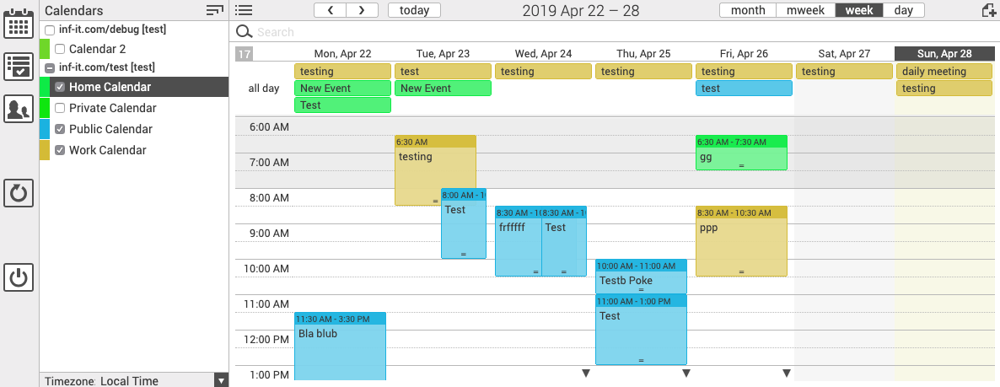

# docker-baikal-infcloud
Dockerized [lighttpd](https://www.lighttpd.net/) + 
php5 + [baikal](https://github.com/sabre-io/Baikal) + 
sqlite3 + [infcloud](https://www.inf-it.com/open-source/clients/infcloud/) 
based on [Alpine Linux](https://mirrordocker.com/_/alpine) (e.g. for NAS)



# Why?

- self-hosted on synology NAS: Synology does not provide an out-of-box solution. 
  There is the CardDAV Servr, 
  the WebDAV Server. now even a Calendar Service with integrated web frontend 
  (but without adressbook). The cons: many spreaded packages and services, with 
  rather old dependencies. You cannot set seperate user/credentials for the DAV
  access which is not soa from a security standpoint as 2fa are not possible and
  simple basic auth mechanisms may leak.
- Alternatives like owncloud/nextcloud or other colaboration suites are too much
  for this simple usecase
- Using baikal for several years without any bigger issues makes it pretty robust
  for family or internal small company/team management.
- You do not need email or other shared services
- Widely supported clients, unfortunetly not natively with Android.
- create backups of calendar and contact data
- Syncs well with Windows, MacOS, Android and iOS

> I use this setup for personal management with the family. As we used it for 
> several years, this project is supporting my migration from a DS213j to 
> DS718+ with Docker. Still not that easy to convince everybody to use cloud ☁︎ 
> services 🤷🏻‍.

# Install and setup

## With sqlite

First build the image
```bash
docker build  --tag "alpine-infcloud-baikal:3.5-0.13.1-0.4.6" --tag "alpine-infcloud-baikal:latest" .
```

Test it with
```bash
docker run \
    --publish 8800:8800 \
    --volume "$(pwd)/baikal:/var/www/baikal/Specific" \
    "alpine-infcloud-baikal"
```

And point your Browser http://localhost:8800/baikal/html/admin/ to configure baikal.

To start the container detached (background) exec

```bash
docker run \
    --publish 8800:8800 \
    --volume "$(pwd)/baikal:/var/www/baikal/Specific" \
    --name baikal-infcloud \
    --restart always \
    --detach \
    "alpine-infcloud-baikal"
```

## With mysql

To start baikal with mariadb (mysql) backend you can use the provided docker-compose file.

You need docker, docker-compose installed. The path `./baikal/db` must be writable.

```bash
docker-compose up
```
> **Note:**
>
> You can use env-vars for the mysql setup, see ./docker-compose.yml file.

Visit http://localhost:8800/baikal/html/admin/ to configure baikal.

# Default config

- no mail support
- Cal/CardDAV URL: http://localhost:8800/baikal/html/dav.php/principals/
- Infcloud: http://localhost:8800/infcloud/

# Autodiscovery

You can support easy mail-style (*username@hostname.domain*) setup by with 
configuring service discovery features as described.
[here](http://sabre.io/dav/service-discovery/).

# HTTPs / SSL / TLS

The current setup does not support https directly and suppose an existing reverse proxy (e.g. https://traefik.io)

# Related projects

There are some other projects related to this topic, but
I couldnt find one using latest Alpine with php7 and a small httpd 
having a small footprint eventually running it with sqlite.

- https://gitlab.com/Plague_Doctor/docker-baikal/ 
  
  Did not support php7 when I created this project and uses nginx instead of lighttpd. Unfortunately I did not find it on my research beforehand.
  The image is [published on docker](https://hub.docker.com/r/plaguedr/baikal) 
  hub, which may be important for others 

- https://github.com/maschel/docker-baikal
  
  Did not work for me (uses php7 with Version 0.4.6 of Baikal [which had problems
  creating calendars for me](https://github.com/bjuretko/docker-baikal-infcloud/issues/8)). Does not incorporate InfCloud

- https://github.com/ckulka/baikal-docker
  
  As the project before. Supports builds for different archs and nginx/apache.
  I planned to incorporate infcloud with the image, [which it doesn't](https://github.com/ckulka/baikal-docker/issues/13) and build an own image running the service with non-root privileges.